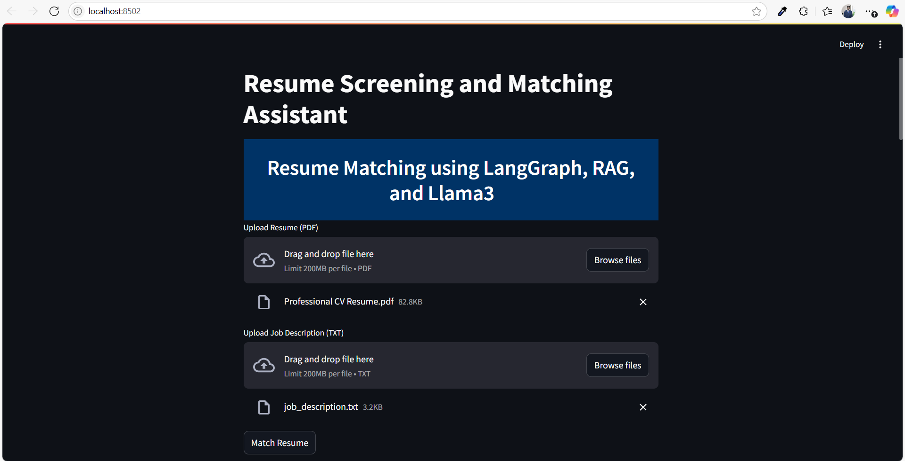

# AI-Powered Resume Matching App

This is a **Streamlit-based application** that leverages a powerful **AI multi-agent workflow** to intelligently **match resumes with job descriptions**. It uses **LangChain**, **LangGraph**, and **OpenAI** models.

---

## Key Features

* Upload **multiple resumes (PDF)** at once and a **job description (TXT or plain text)**.
* Configure scoring weights using sliders:
  * Skills
  * Experience
  * Education
  * Extras (certifications/projects/awards)
* Click on **"Match Resumes"** to run batch analysis.
* The app:

  * Displays a **LangGraph workflow diagram** showing connected agents (nodes and edges).
  * Executes the AI workflow for each uploaded resume:

    * Shows **individual outputs** from each agent.
    * Provides a **final verdict** with a **match score out of 100**.
    * Delivers a **detailed explanation** of the decision.
  * Produces a **ranked candidate table** by total score.

---

## Candidate Score

The final **Recruiter Agent** evaluates the resume and job description, assigning a **match score out of 100** based on:

* Skills match
* Experience match
* Education match
* Extras (certifications, awards, side projects)

> Recruiters can tune category weights in the UI to match role-specific priorities.

---

## AI Agent Workflow

Here’s an overview of the agents involved and their roles in the system:

### 1. **Resume Agent**

* Extracts the **candidate’s name** and other key details from the uploaded resume.

### 2. **Job Description (JD) Agent**

* Analyzes the **job description** to extract **key requirements** and expectations.

### 3. **RedFlag Agent**

* Analyzes the resume to identify potential issues like job hopping, gaps, skill inconsistencies, missing education, and errors, then returns clear flagged points.


### 4. **Recruiter Agent (Final Decision Maker)**

* Combines insights from:

  * JD Agent
  * Redflag agent
  * Resume file
* Produces:

  * A **detailed evaluation**
  * A **match score (out of 100)**
  * The **final recommendation**

---

## Technologies Used

* **Python**
* **Streamlit**
* **LangChain + LangGraph**
* **OpenAI API (via langchain-openai)**
* **Hugging Face Instruct Embeddings**
* **Chroma DB (vector store)**
* **PyPDFLoader**
* **BeautifulSoup + Requests**

---

## Visual Workflow

The app dynamically generates a **LangGraph workflow diagram**, visually explaining the data flow between all agents. This provides complete transparency and traceability.


## Example Use Case

1. Upload one or more candidate **resumes (PDF)**.
2. Upload or paste the **job description (TXT/text)**.
3. Adjust scoring sliders if needed.
4. Click **"Match Resumes"**.
4. Instantly get:

   * Agent workflow diagram
   * Per-candidate outputs from each agent
   * **Final match score** per candidate
   * **Ranked candidates table**
   * Recruiter's **reasoned verdict**

---

## Environment Setup

Create/update `.env` with your OpenAI key:

```env
OPENAI_API_KEY="your_openai_api_key"
OPENAI_MODEL="gpt-4o-mini"
```

`OPENAI_MODEL` is optional; default is `gpt-4o-mini`.

---

## 📬 Contact

**Haroon Sajid** – *AI Developer & Data Enthusiast*
- 📧 **Email:** [haroonsajid016@gmail.com](mailto:haroonsajid016@gmail.com)
- 🌐 **Website:** [haroonsajid.com](https://haroonsajid.com)

> Feel free to reach out for suggestions, feedback, or collaboration!